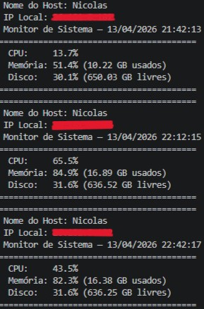
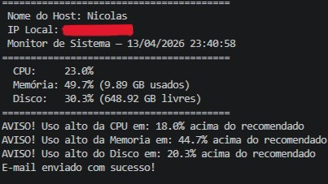
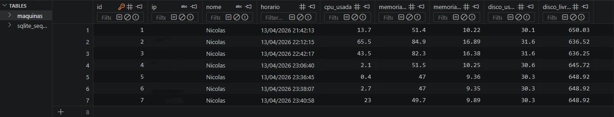
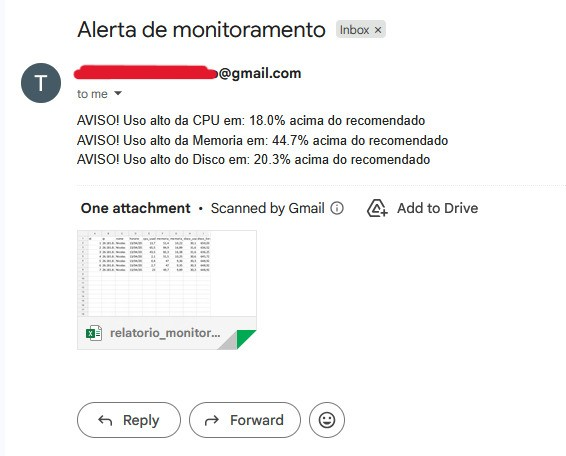
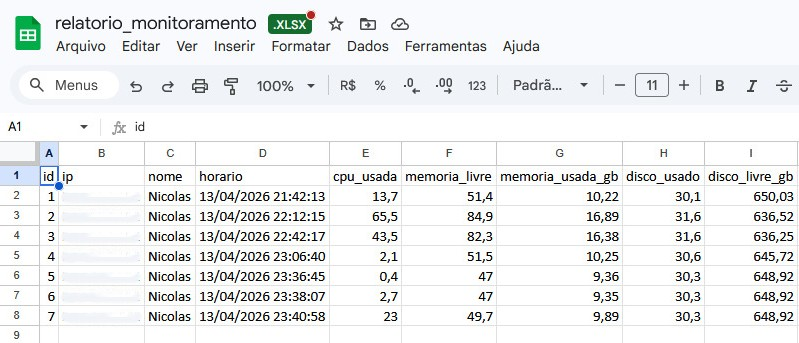

# 🖥️ Monitor de Infraestrutura / Infrastructure Monitor

> Sistema de monitoramento de recursos do sistema com alertas automáticos por e-mail e geração de relatórios.  
> System resource monitoring with automatic email alerts and report generation.

---

## 🇧🇷 Português

### Sobre o projeto

Sistema desenvolvido em Python para monitorar recursos de máquinas em tempo real. Coleta dados de CPU, memória e disco, salva o histórico em banco de dados, gera relatórios em Excel e envia alertas automáticos por e-mail quando algum recurso ultrapassa o limite definido. Ideal para ambientes corporativos com múltiplas máquinas.
<br>
[](https://skillicons.dev)
<br>
### Funcionalidades

- Coleta automática de CPU, memória e disco a cada 30 minutos
- Identificação da máquina por nome e IP
- Histórico salvo em banco de dados SQLite
- Geração de relatório em Excel (`.xlsx`) e CSV
- Envio automático de e-mail com alertas e relatório anexado
- Agendamento automático em segundo plano

### Tecnologias utilizadas

| Biblioteca | Uso |
|---|---|
| `psutil` | Coleta de dados do sistema |
| `sqlite3` | Banco de dados local |
| `pandas` | Geração de relatórios |
| `openpyxl` | Exportação para Excel |
| `smtplib` | Envio de e-mails |
| `schedule` | Agendamento automático |
| `python-dotenv` | Gerenciamento seguro de credenciais |

### Estrutura do projeto

```
monitorarPY/
│
├── monitor.py          # Arquivo principal — orquestra tudo
├── alertas.py          # Detecção de alertas por threshold
├── banco.py            # Persistência no SQLite
├── relatorio.py        # Geração de Excel e CSV
├── email_alerta.py     # Envio de e-mail automático
├── monitor.db          # Banco de dados (gerado automaticamente)
├── relatorio_monitoramento.xlsx  # Relatório (gerado automaticamente)
├── dados.csv           # Dados em CSV (gerado automaticamente)
├── .env                # Credenciais (não versionado)
└── .gitignore
```

### Como executar

**1. Clone o repositório**
```bash
git clone https://github.com/NickGMaia/monitor-infra.git
cd monitor-infra
```

**2. Instale as dependências**
```bash
pip install psutil pandas openpyxl schedule python-dotenv
```

**3. Configure o arquivo `.env`**

Crie um arquivo `.env` na raiz do projeto com as seguintes variáveis:
```
EMAIL_REMETENTE=seuemail@gmail.com
EMAIL_SENHA=sua_senha_de_app
EMAIL_DESTINATARIO=destinatario@gmail.com
```

> Para gerar uma senha de app do Gmail, acesse: [myaccount.google.com/apppasswords](https://myaccount.google.com/apppasswords)

**4. Execute o sistema**
```bash
python monitor.py
```

O sistema irá rodar imediatamente e repetirá automaticamente a cada 30 minutos.

### Configurando os thresholds de alerta

No arquivo `alertas.py`, ajuste os limites conforme necessário:

```python
cpu_alert = 80      # Alerta quando CPU ultrapassar 80%
memoria_alert = 85  # Alerta quando memória ultrapassar 85%
disco_alert = 90    # Alerta quando disco ultrapassar 90%
```

### Melhorias planejadas (v2)

- Limpeza automática de registros com mais de 12 horas
- Dashboard web para visualização do histórico
- Suporte a monitoramento de múltiplos servidores remotos
- Integração com Slack para notificações
---

##
<div align="center">
    <h1>Sistema em uso / system in use<h1>
</div>

<div align="center">
    
    
</div>
<BR>
<div align="center">
    
</div>
<BR>
<div align="center">
    
    
</div>


##
---

## 🇺🇸 English

### About

A Python-based system for real-time machine resource monitoring. It collects CPU, memory and disk data, stores history in a database, generates Excel reports, and sends automatic email alerts when any resource exceeds a defined threshold. Designed for corporate environments with multiple machines.
<br>
[](https://skillicons.dev)
<br>
### Features

- Automatic CPU, memory and disk collection every 30 minutes
- Machine identification by hostname and IP address
- History saved in a local SQLite database
- Report generation in Excel (`.xlsx`) and CSV formats
- Automatic email alerts with attached report
- Background scheduling with no manual intervention

### Tech stack

| Library | Purpose |
|---|---|
| `psutil` | System data collection |
| `sqlite3` | Local database |
| `pandas` | Report generation |
| `openpyxl` | Excel export |
| `smtplib` | Email sending |
| `schedule` | Automatic scheduling |
| `python-dotenv` | Secure credential management |

### Project structure

```
monitorarPY/
│
├── monitor.py          # Main file — orchestrates everything
├── alertas.py          # Threshold-based alert detection
├── banco.py            # SQLite persistence
├── relatorio.py        # Excel and CSV generation
├── email_alerta.py     # Automatic email sending
├── monitor.db          # Database (auto-generated)
├── relatorio_monitoramento.xlsx  # Report (auto-generated)
├── dados.csv           # CSV data (auto-generated)
├── .env                # Credentials (not versioned)
└── .gitignore
```

### How to run

**1. Clone the repository**
```bash
git clone https://github.com/your-username/monitor-infra.git
cd monitor-infra
```

**2. Install dependencies**
```bash
pip install psutil pandas openpyxl schedule python-dotenv
```

**3. Configure the `.env` file**

Create a `.env` file in the project root:
```
EMAIL_REMETENTE=youremail@gmail.com
EMAIL_SENHA=your_app_password
EMAIL_DESTINATARIO=recipient@gmail.com
```

> To generate a Gmail app password, visit: [myaccount.google.com/apppasswords](https://myaccount.google.com/apppasswords)

**4. Run the system**
```bash
python monitor.py
```

The system will run immediately and repeat automatically every 30 minutes.

### Configuring alert thresholds

In `alertas.py`, adjust the limits as needed:

```python
cpu_alert = 80      # Alert when CPU exceeds 80%
memoria_alert = 85  # Alert when memory exceeds 85%
disco_alert = 90    # Alert when disk exceeds 90%
```

### Planned improvements (v2)

- Automatic cleanup of records older than 12 hours
- Web dashboard for history visualization
- Support for monitoring multiple remote servers
- Slack integration for notifications

---

## Autor / Author

**Nicolas Garcia Soto Maia**  
[GitHub](https://github.com/NickGMaia) • [LinkedIn](www.linkedin.com/in/nicolasgsmaia)
